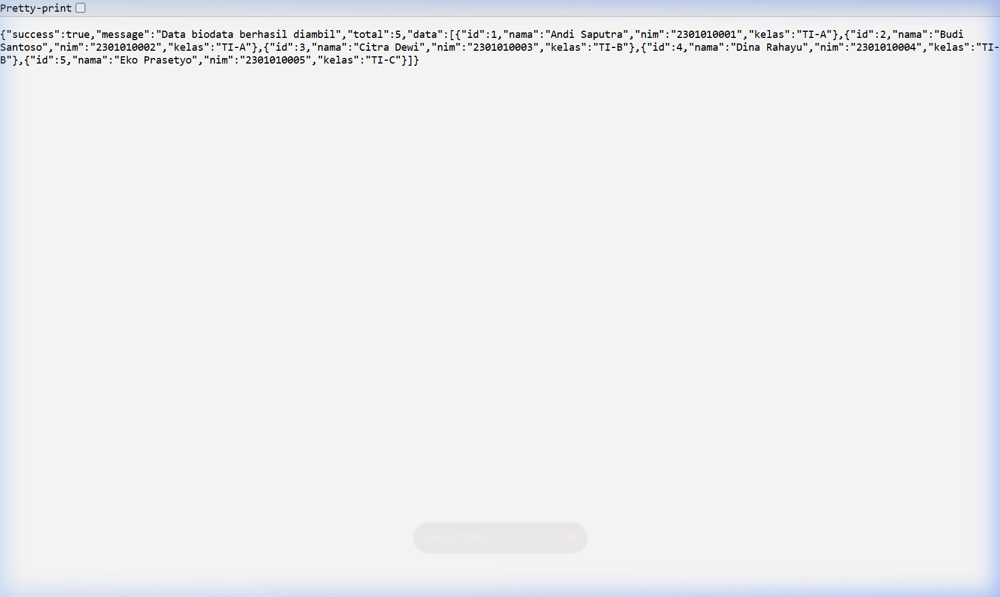
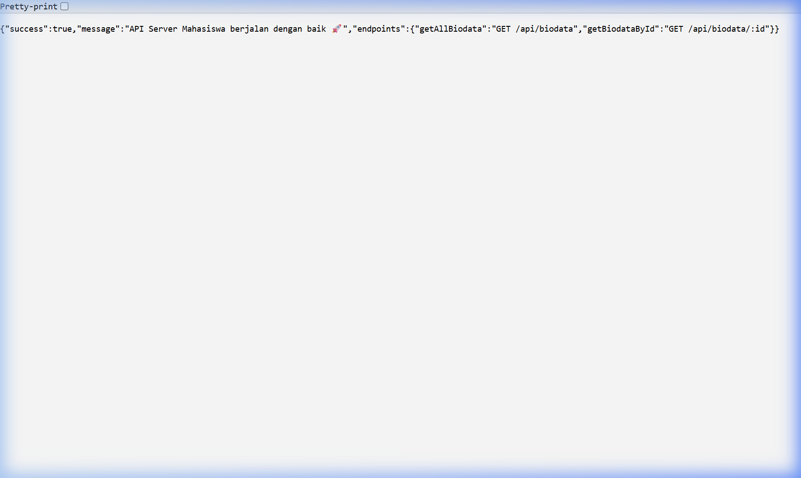

# 🎓 Express.js + PostgreSQL — Connection Database Mahasiswa

Proyek Express.js untuk koneksi database PostgreSQL dengan tabel `biodata` mahasiswa. Dibuat sebagai tugas **Pemrograman Web Server — Meeting 3**.

---

## 📋 Deskripsi

Program ini adalah REST API sederhana berbasis **Express.js** yang terhubung langsung ke database **PostgreSQL**. Semua kode diletakkan pada satu file utama `index.js` untuk kemudahan pengumpulan praktikum.

---

## 🛠️ Teknologi yang Digunakan

- Node.js
- Express.js
- PostgreSQL
- pg (node-postgres)
- dotenv

---

## 🗄️ Struktur Database

**Database:** `Data Piska`

**Tabel:** `biodata`

| Kolom | Tipe Data | Keterangan |
|-------|-----------|------------|
| `id` | SERIAL | Primary Key, Auto Increment |
| `nama` | VARCHAR(100) | Nama mahasiswa |
| `nim` | VARCHAR(20) | NIM mahasiswa (UNIQUE) |
| `kelas` | VARCHAR(20) | Kelas mahasiswa |

---

## 📁 Struktur Proyek

```
Meeting 3/
├── screenshots/
│   ├── get_all_biodata.png # Screenshot hasil GET semua data
│   └── root_endpoint.png   # Screenshot root endpoint
├── .env                    # Konfigurasi database (diabaikan git)
├── .env.example            # Template konfigurasi environment
├── .gitignore              # Mengabaikan node_modules & .env
├── index.js                # Kode program utama (DB, routes, controller)
├── package.json            # Metadata proyek & dependencies
├── package-lock.json       # Dependency lock file
└── README.md               # Dokumentasi proyek
```

---

## ⚙️ Instalasi & Menjalankan

### 1. Clone repository

```bash
git clone https://github.com/wpiskaa/024_ConnectionDb.git
cd 024_ConnectionDb
```

### 2. Install dependencies

```bash
npm install
```

### 3. Konfigurasi environment

Buat file `.env` di root folder proyek:

```env
DB_HOST=localhost
DB_PORT=5432
DB_USER=postgres
DB_PASSWORD=your_password
DB_NAME=Data Piska
PORT=3000
```

### 4. Jalankan server

```bash
npm start
```

Server akan berjalan di: `http://localhost:3000`

---

## 📸 Screenshot Hasil

### GET /api/biodata — Semua Data



### Root Endpoint


